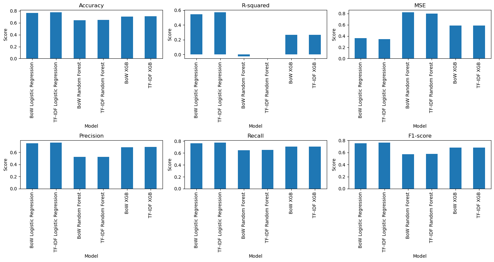
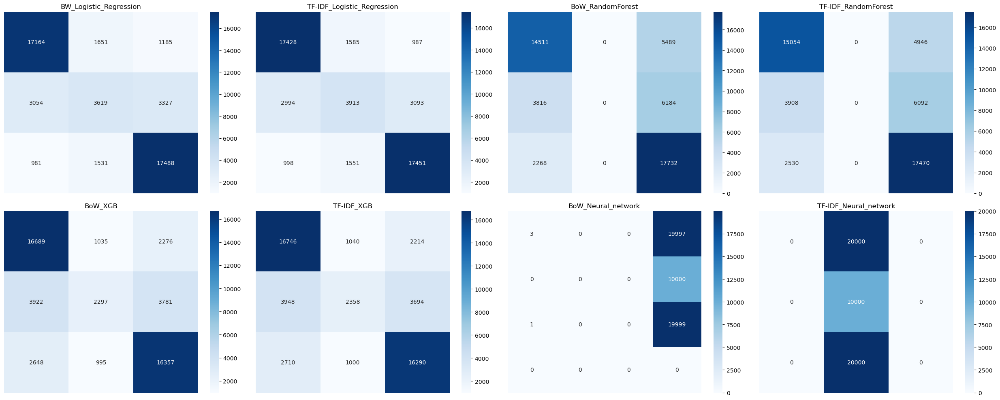
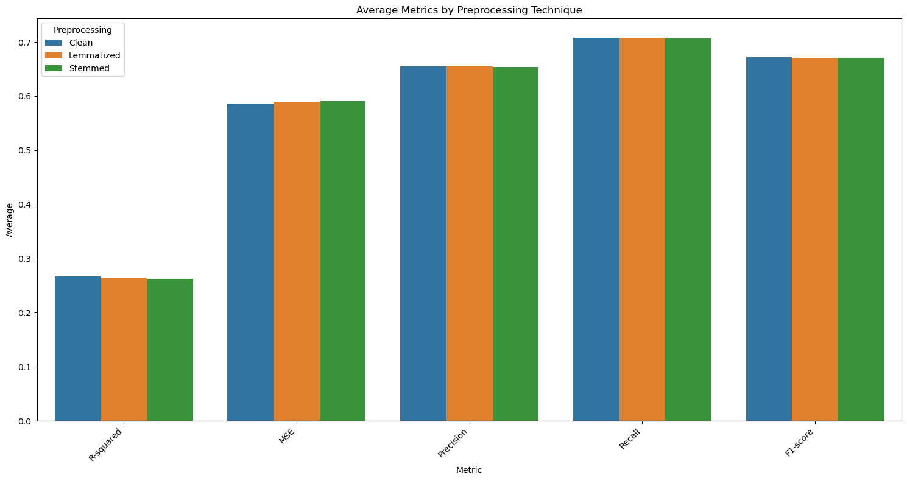
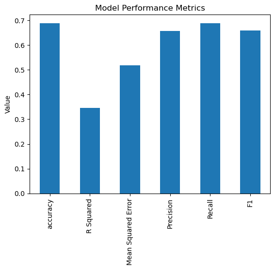
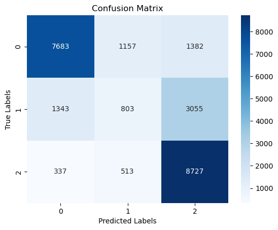
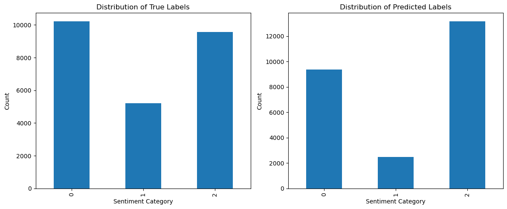
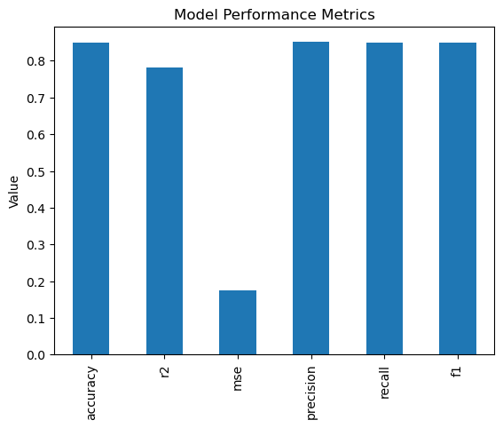
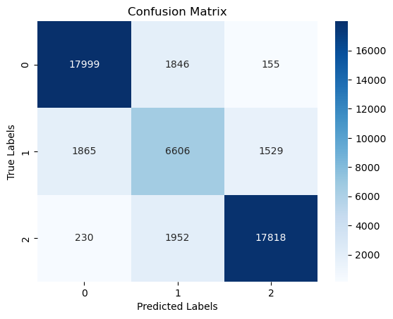

# Large Language Model Project J

 - Our mission is to build a Large Language Model that can detect a Positive, Neutral, and Negative sentiment from a yelp review, and compare the results it produces against more mundane methods, including:
    1. Logistic regression models
    2. A pre-trained model built by someone else.
 - We are also looking at the different ways text can be represented in a system for these models.
 - View my presentation [here](https://youtu.be/1_XvFe_vFLY)

 Important note, the data-files are quite large so have been kept out of this git, they are easily reproducable using the code in the notebooks and the [yelp](https://huggingface.co/datasets/Yelp/yelp_review_full) dataset on huggingface

## [1-preprocessing.ipynb](notebooks/1-preprocessing.ipynb)
 
 - Loading the Yelp Reviews Full dataset
 - Pre-processing with 3 different methods
    1. Cleaned the dataset:
        - Removed all non-alphanumeric characters.
        - Converted all text to lowercase.
        - Removed stop words using the NLTK stop word list.
    2. Perform Stemming on the above cleaned dataset
        - Brings words down to the root words by chopping off the tail of the word. (PorterStemmer)
            - NOTE: Stemming can result in non-words but is generally faster.
    3. Performed lemmatization on the above cleaned dataset
        - Brings words down to the root words by use of a dictionary. (WordNet Lemmatizer)
            - NOTE: Lemmatization produces valid words however is more computationally intensive
    4. Altered our Labels
        - Scale was originally out of 5 stars but we are going for a positive, neutral, negative sentiment analysis
        - Altered the scale where labels (0,1) became 0 (negative), label 2 became 1(neutral), label (3,4) became 2 (positive)

## [2-representation](notebooks/2-representation.ipynb)

We are going to run Bowl of Words and TFIDF methods of representation on our text, fortunately we cleaned it all up already so we can just load the "clean_dataset" that we have already made and run the methods on that

 - First issue I immediately ran into was TFIDF requires strings not tokens so I had to recombine the sentences, easy enough to start
 - Following up I immediately ran into memory issues, turns out though it is unneccesary and INCREDIBLY resource heavy to convert a tfidf matrix back into a dataframe, after struggling with that, changing to a cloud system and even buying more resources I found out about this.
 - Following I found I was still  running into issues in terms of memory and computational power so I adjusted the limitations on tfidf with the option to increase them again at a later date as possibly reqiured.
    - After many differing attempts i settled on 50000 rows and 10000 features for tfidf and ran several different models with varying levels of terribleness
 - we also see that the resultss are MUCH better on our regular networks than our basic neural network so we wouldn't need from this set-up 

 #### Day 2 model Metrics -- Lemmatized words

#### Day 2 model confusion matrices

#### Day 2 comparison of the different techniques (lemmatized, stemmed, cleaned)
 - Taken from the averages of each model 

## [3 Pre-Trained model](notebooks/3-pre-trained-model.ipynb)

### Starting off with a [pre-trained model](https://huggingface.co/cardiffnlp/twitter-roberta-base-sentiment-latest)
 - Initial Model Selection and Issue Identification:

    - My initial model selection was based on the first thing I found. However, a quick test with the input 'She bad' resulted in a positive sentiment analysis so I decided to be a little more picky. 
        - After adjusting search a few times I settled on the most downloaded model from the sentiment analysis as it had excellent documentation to back it up and initial tests ("she bad") came back in the expected Negative.
        - Major drawback is this model was trained on twitter instead of restaurant reviews so there is a significant domain difference for language used.

 - Test Set Evaluation:

    - To rigorously evaluate the cardiffnlp model, I ran my test dataset through it.

 - Performance Analysis and Comparison:

    - By comparing the model's predicted numerical labels with the actual labels in the test set, I was able to calculate evaluation metrics such as Accuracy, F1, Recall.
    
| Metric   | Value    |
| -------- | -------- |
| Accuracy | 0.68852  |
| R2       | 0.34567  |
| MSE      | 0.51776  |
| Precision| 0.65702  |
| Recall   | 0.68852  |
| F1       | 0.65835  |

## [4-Optimization](notebooks/4-optimization.ipynb)
 
  - Chose "distilbert-base-uncased" for my model as I wanted to create my model without any inbuilt bias from other training sets.
 - Ran initial hyperparamter testing on 20000 rows for training set and 2000 rows for test set (stratified to preserve the balance in the sections)

 - Best model:

| Trial | F1 Score | Epochs | Learning Rate     | Weight Decay      | Batch Size |
|-------|----------|--------|-------------------|-------------------|------------|
| 0     | 0.6138   | 1      | 1.66880e-04       | 2.28560e-03       | 8          |
| 1     | 0.7930   | 3      | 6.36204e-05       | 2.02450e-03       | 16         |
| 2     | 0.7909   | 5      | 1.02753e-04       | 2.43321e-05       | 32         |
| 3     | 0.7957   | 4      | 1.52743e-05       | 1.65698e-04       | 32         |
| 4     | 0.7234   | 5      | 2.49957e-04       | 1.17599e-03       | 32         |

- Hyperparamaters and what they told us:
    - Learning Rate:
        - Clear evidence of a lower learning rate giving higher scores, look at 1 and 3 scoring higher than the rest with a marked difference between 3 and 4 with learning rate being the major differing factor
    - Epochs:
        - We can see a sweet spot of 3/4 epochs with less than that underfitting and more (trials 2 and 4) having a greater Validation Loss in later epochs (evidence of overfitting)
    - Per-device Train Batch Size:
        - Not as drastic an affect as we had expected with this one, not enough runs to show that this was making a major difference with trials 1 and 3 having the best scores but differing batch sizes
    - Weight Decay:
        - Also does not appear to have an overly pronounced affect, however the values we are using are fairly similar across the board.

- Taking the best model from the hyperparameter training we fine tuned it on the entire dataset with the same settings it was originally trained on creating our final model which we have stored on [hugging face](https://huggingface.co/FinchW/my-yelp-sentiment-model-finetuned)

## [5-Deployment](notebooks/5-deployment.ipynb)
 - Concerns:
    - Privacy concerns
        - dataanonymization techniques
        - differential privacy
        - transparent data usage policies
    - data Quality
    - model evaluation
    - memory management

|   Metric | Values   |
|----------|----------|
| accuracy | 0.848460 |
| r2       | 0.781700 |
| mse      | 0.174640 |
| precision| 0.850746 |
| recall   | 0.848460 |
| f1       | 0.849493 |

## Future Plans
 - Future plans for this project is to run back through and seperate my functions file out into more aptly grouped selections (Global variables, cleaning functions, LLM functions, etc.)

